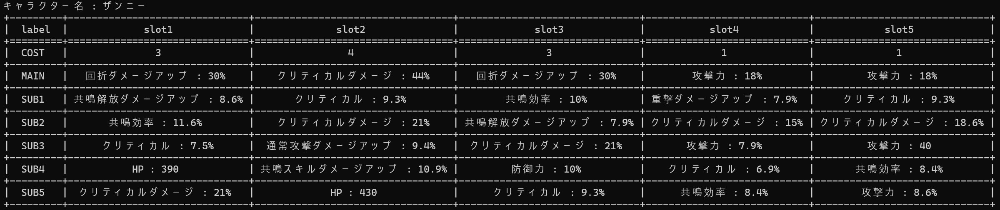
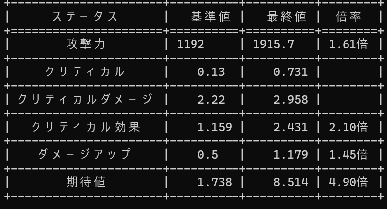

# 前提
- python3がインストール済み
- tesseractがインストール済み

## Ubuntu
```
sudo apt update
sudo apt install tesseract-ocr tesseract-ocr-jpn python3 python-is-python3
```

## WSL
```
wsl --install -d Ubuntu-24.04
# あとはUbuntuと同じ
```


# 開発・テスト環境
- python 3.12.3 + tesseract 5.3.4 / Ubuntu 24.04
- Python 3.12.3 + tesseract 5.3.4 / Ubuntu 24.04 on WSL2

# 準備
https://discord.com/channels/1035380212927574068/1323191401378222122

ここでデータを取得したい共鳴者の画像を生成してください。

# 使い方
## 環境構築
```
git clone https://github.com/kotruct/wuwa-bot-parser.git
cd wuwa-bot-parser
python -m venv .venv
source .venv/bin/activate
pip install -r requirements.txt
```

## 実行
### 表形式で表示
```
python parser.py https://wutheringwaves-discord.kurogames-global.com/back/cd/{ID}.jpeg
python parser.py {ID}.jpeg # {ID}.jpegはファイルパス ファイル名は自由
```



以下でJSON形式でも取得できる
```
import parser
json_data = parser.generate_json(path)
```

```
{
  "name": "カルロッタ",
  "slots": [
    {
      "COST": "4",
      "MAIN": {
        "name": "クリティカル",
        "value": "22%"
      },
      "SUB": [
        {
          "name": "通常攻撃ダメージアップ",
          "value": "8.6%"
        },
        
        ...

      ]
    },

    ...

  ]
}

```

### 総合スコア
```
python score.py https://wutheringwaves-discord.kurogames-global.com/back/cd/{ID}.jpeg
python score.py {ID}.jpeg
```



参照: https://wikiwiki.jp/w-w/%E3%83%80%E3%83%A1%E3%83%BC%E3%82%B8%E8%A8%88%E7%AE%97%E5%BC%8F#u8393035

ダメージ計算式から、エコーのステータスによるダメージ上昇効果を見積もる。

> ダメージ = 攻撃力 × スキル倍率 × ダメージ倍率アップ × ダメージアップ × ダメージブースト × クリティカル補正 × 防御補正 × 敵耐性補正 × 被ダメージ補正

エコーのステータスで影響を受けるのは、
- 攻撃力
- ダメージアップ
- クリティカル補正

なので、この3つによる変化を見積もるものとする。


その他の倍率は立ち回りや編成に依るものと考え、エコーの評価には入れない。

評価する際には、`data/{キャラクター名}.csv`にエコー以外の攻撃力、ダメージアップ、クリティカル補正に関わる値を記入し、`data/{キャラクター名}.txt`に計算対象のダメージアップのリストを記入しておく。

`data/{キャラクター名}.csv`
```
基礎攻撃力, 1269
クリティカル, 13%
クリティカルダメージ, 198.6%
ダメージアップ, 50%
```
- 基礎攻撃力: エコーをすべて外した時の攻撃力 + スキル等による補正
- クリティカル: エコーをすべて外した時のクリティカル率 + スキル等による補正
- クリティカルダメージ: エコーをすべて外した時のクリティカルダメージ + スキル等による補正
- ダメージアップ: エコーをすべて外した時のダメージアップ + スキル等による補正

`data/{キャラクター名}.txt`
```txt:data/{キャラクター名}.txt
共鳴スキルダメージアップ
凝縮ダメージアップ
```

スキル等による補正は共鳴スキル、共鳴解放、終奏スキル、音骸スキル、武器スキル、凸効果など


現状はアタッカーの評価のみで、また、共鳴効率によるローテーションの変化など考慮できていない部分も多いです。
